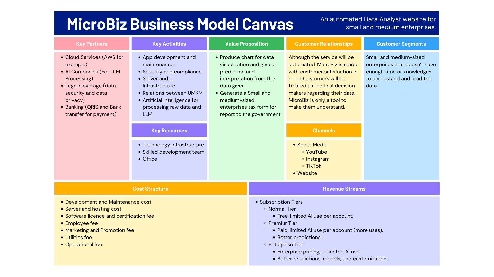

# MicroBiz

A website that performs automatic data analysis and tax form generation for micro, small, and medium enterprises (MSMEs).

For prototype [visit here](https://microbiz.vercel.app)

## Features

- Automated Data Analysis - One of our products can create insights from the data you provide. The data will be shown using charts or plots and make it easier for users to make decisions. Also, it will provide predictions and interpretation based on data given.
- Tax Form Generator (Indonesia) - Our products make it easy for users to create tax form to be reported to the Tax Office. This can shorten the time and automatic calculation based on input from the user.

## Author

- Gregory Nicolla
- Rasyad Muhammad Ramdhanazuri
- Reyza Rahmatsyah
- Richard Gregorius
- Zaphenath Paneah Joseph Irawan

## Business Model Canvas

